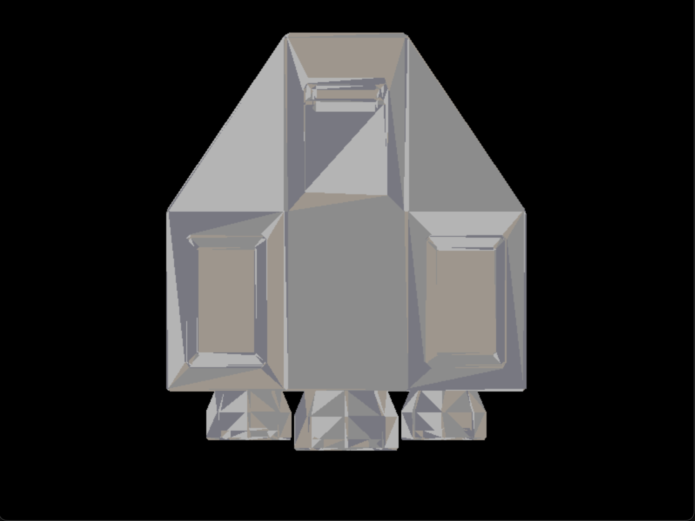

# Spaceship 3D Renderer

This project is a software renderer for a 3D spaceship model created in Blender. It demonstrates basic 3D rendering concepts including model loading, triangle rasterization, and basic transformations.

## Overview

The renderer loads a 3D model (.obj file) of a spaceship and displays it on screen using software-based rendering techniques. The implementation includes:

- Custom OBJ file loader
- Triangle rasterization algorithm
- Basic camera controls
- Simple lighting model
- Framebuffer management

## Result



## Features

- Load and render 3D models in OBJ format
- Rotate and move the model using keyboard controls
- Colored faces with simple shading
- Backface culling for correct rendering
- Perspective projection for 3D display

## Controls

- **Arrow keys**: Rotate the spaceship
- **W, A, S, D**: Move the spaceship
- **R**: Reset position and rotation
- **F**: Flip the spaceship direction
- **ESC**: Exit the application

## Implementation Details

The renderer is built from scratch without using hardware acceleration. Key components include:

1. **Framebuffer**: A custom buffer that stores pixel data before being sent to the screen
2. **Color System**: RGB color management for rendering
3. **Triangle Rasterization**: Algorithm to fill triangles with color
4. **OBJ Model Loader**: Parses OBJ files to extract vertices and faces
5. **Transformation System**: Applies rotations, translations, and scaling to the model

## Dependencies

- SDL2: For window management and pixel rendering
- GLM: For vector math operations

## Building the Project

1. Ensure you have Rust and cargo installed
2. Clone the repository
3. Run `cargo build --release`
4. Execute with `cargo run --release`

## Project Structure
```
.
├── Cargo.toml
├── src/
│   ├── main.rs          # Main application entry point
│   ├── color.rs         # Color handling
│   ├── framebuffer.rs   # Framebuffer implementation
│   ├── triangle.rs      # Triangle rasterization
│   └── obj_loader.rs    # OBJ file parser
├── models/
│   └── NavePrototipo2.obj  # Spaceship model
└── space_ship.png       # Rendered output
```

This project was developed as part of the Computer Graphics course, using Rust to implement a custom software renderer.
